# PlumbBob

<p align="center">
  
</p>

<p align="center">
  <a href="https://robmclarty.github.io/plumbbob/">Website</a> ·
  <a href="https://robmclarty.github.io/plumbbob/docs.html">Docs</a> ·
  <a href="https://robmclarty.github.io/plumbbob/api.html">API reference</a>
</p>

PlumbBob is a Claude Code plugin — thirteen skills and a small CLI — that runs
LLM-assisted coding as a loop you control. You and the model settle the plan in a file
*before* any code; then the model builds one small step at a time and **stops after
each one**, waiting for you to read the diff and approve it before anything is
committed. It's built for the small-to-medium work that fills most days — a feature, a
bug, a refactor — where a fully autonomous build is overkill but freestyle prompting
leaves you dragged behind the model, reacting instead of deciding.

> Establish *plumb* before you build. The LLM is a hand, not a head.

Its one law is **vibe to execute, never vibe to decide**: the human owns every
decision, the LLM owns the labor, and the boundary between them is a **pause you
advance**, not a wall that refuses you. The *why* behind that — attention as the scarce
resource — is in [`docs/attention-first-development.md`](docs/attention-first-development.md).
PlumbBob is the layer below [Ridgeline](https://github.com/robmclarty/ridgeline): where
Ridgeline runs large, settled work autonomously without you, PlumbBob keeps you in the
driver's seat for the work your judgment has to steer. This repository was built using
PlumbBob itself, running its own loop.

## What a prompt can't replicate

A system prompt can *ask* a model to plan first and stop for review. What it can't do is
**hold the line when the model doesn't** — and that mechanical half is what PlumbBob adds
under the skills. Five deterministic edges, enforced by the CLI and git rather than by the
model's goodwill:

- **A gate that refuses red.** `checkpoint` won't record a step while the check gate is
  red, and `start` refuses a dirty tree — the [checkride](https://www.npmjs.com/package/checkride)
  run (types, lint, tests, dead code, docs) has to pass before a step lands.
- **One SHA per verified step.** Every approved step is its own git commit against a
  recorded baseline — a ledger of checkpoints, not one undifferentiated diff at the end.
- **A preservation-aware revert.** `/plumbbob:revert` resets exactly to a recorded checkpoint
  SHA while keeping your plan and notes intact, and restores *only* SHAs the loop wrote.
- **A build record that rides the PR.** The tracked `builds/<slug>/` folder — intent, log,
  checkpoints, report — merges into `main` with the branch instead of dying with the
  worktree; the archive never destroys.
- **The approval latch.** `checkpoint` refuses to land a step until the harness records a
  human turn since that step began ([D64 (approval-latch)](docs/decisions.md#d64)–[D66
  (oob-commits-surfaced)](docs/decisions.md#d66) — the ledger-plane enforcement), so the
  model can't self-commit past you — the refusal *is* the pause.

The planning surface is the on-ramp; these five are the floor under it. And the latch's
payoff is [measured, not asserted](#why-not-just), not just claimed. **Guidance on the
work, a latch on the record.**

## The loop in one picture

<p align="center">
  
</p>

Everything the model must stay true to lives in one file, the build's `intent.md`
(under `.plumbbob/builds/<slug>/`), written before any code: the **Frame** (the problem, what done looks like, what you're
explicitly *not* doing), the **Decisions** and **Constraints** (the settled calls, each
with its *because*), and the **Steps** — a numbered list where every step carries a
**done-when** (a checkable finish line, ideally a test) and a **seam** (the files it's
expected to touch).

```text
/plumbbob:plan       decide everything on paper — frame, decisions, all steps    (once)
  per step:
    /plumbbob:build      implement the next step → run checks → self-review → PAUSE
    (approve)            → the step is committed as a checkpoint; fire /plumbbob:build again
/plumbbob:finish     report what shipped and why, final commit, clear            (once)
```

Nothing is locked and nothing refuses you — the loop does a step's labor, pulls up to
the line, and waits for you to advance it. **You are the clock.**

## Install

PlumbBob installs **once, globally** — like `gh` or your dotfiles. There are two ways;
pick one (both register a Claude Code plugin named `plumbbob`, so running both
collides).

**Marketplace plugin** — Claude Code installs the published `plumbbob` package for you
(skills, hook, and the CLI on PATH), so you run no `npm i -g` and no `init`:

```text
/plugin marketplace add robmclarty/agent-tools
/plugin install plumbbob@robmclarty
```

**npm global + `init`** — installs the CLI, then links the skills and hook into Claude
Code in place:

```sh
npm i -g plumbbob      # the CLI (also a `pb` shorthand)
plumbbob init          # link it into Claude Code; --uninstall to undo
```

Restart Claude Code (or `/reload-plugins`) to activate, then run `plumbbob doctor`
(or `/plumbbob:doctor` in-session) to confirm the wiring. The full guide — namespacing,
per-project sessions, the agent-neutral roadmap — is in
[`docs/install.md`](docs/install.md).

## Your first session

In Claude Code, inside any git repo with a clean tree:

1. **Plan.** Fire `/plumbbob:plan` and give it whatever you have — nothing (it interviews
   you), a rough line (`/plumbbob:plan rate-limit POST /login, 5/min/IP, return 429`), or a
   path to a spec file. Together you fill the build's `intent.md`. No code is written
   yet.
2. **Build.** Fire `/plumbbob:build`. It implements the next undone step, runs the
   heavy check gate, reviews its own diff against the plan, and stops:

   ```text
   PAUSE — read the diff as an editor. Approve to checkpoint, or send fixes.
   ```

   (The check gate is [checkride](https://www.npmjs.com/package/checkride) — one
   run across the tools your repo already configures: types, lint, tests, dead
   code, docs. To gate through your own command instead, set the `"check"` key in
   `.plumbbob/settings.json`, e.g. `"check": "npm test"`.)
3. **Approve** — or send fixes. On your OK it commits the step as a checkpoint, marks
   it done, and returns to the boundary. Fire `/plumbbob:build` again for the next step —
   re-firing it *is* the clock tick. Whenever you lose the thread, `/plumbbob:status` shows
   where you are and names the next move.
4. **Finish.** When the last step is done, `/plumbbob:finish` writes a report of what shipped
   and why into the build's tracked folder, makes the final commit, and clears the slate
   for the next goal. The folder rides the branch into the PR — the build's record merges
   into `main` instead of dying with the worktree.

A mid-build "ooh, what if…" never derails the step: `/plumbbob:park` captures it to a list
in one line, and `/plumbbob:harvest` triages the list between steps. One goal walked end to
end, with the real output at every stage, is in
[`docs/happy-path.md`](docs/happy-path.md).

## The skills

You drive the whole loop from your IDE with `/plumbbob:*` skills — no step numbers to
remember, no raw CLI to type. Every skill is `disable-model-invocation`, so *you* fire
every move, and `/plumbbob:status` always names your next one. (Claude Code namespaces
them under the plugin, so the command is `/plumbbob:plan`. The bare `/plan` reaches it
too — but only where nothing else owns that name, and four of the thirteen share one with
a Claude Code built-in, so these docs write the full form.)

**The happy path** — the three moves every session makes; many sessions need
nothing else:

| Skill  | Does |
|------------------------------------|------|
| `/plumbbob:plan` | plan the whole goal — open the session and author intent's Frame, Decisions, Constraints, **and all Steps** |
| `/plumbbob:build` | implement the next planned step, then verify it to the pause — `--auto` self-approves and chains to done; a range like `1-3` self-approves through step 3, then pauses |
| `/plumbbob:finish` | finish up — write the report, make the final commit, clear for a fresh goal |

**Plan-shaping moves** — optional, for when the plan needs work mid-flight:

| Skill  | Does |
|------------------------------------|------|
| `/plumbbob:step` | revise/sharpen the next step (empty input auto-syncs it to reality) |
| `/plumbbob:refine` | attack the frame for holes, or repair a drifted plan |
| `/plumbbob:spike` | throwaway worktree experiment for a fork the plan can't settle |

**Helpers** — orient, verify, recover, diagnose:

| Skill  | Does |
|------------------------------------|------|
| `/plumbbob:status` | orient — where you are, the next step's done-when and seam, and the next move |
| `/plumbbob:verify` | the tick, standalone — check → self-review → validate → **PAUSE** → checkpoint, for a diff `/plumbbob:build` didn't write |
| `/plumbbob:revert` | rewind — `git reset --hard` to a recorded checkpoint |
| `/plumbbob:recover` | reconcile the session's own state when the dashboard looks wrong |
| `/plumbbob:doctor` | check the install from inside a session |

**Capture** — the park/harvest loop for mid-build ideas:

| Skill  | Does |
|------------------------------------|------|
| `/plumbbob:park` | capture a mid-build idea without chasing it |
| `/plumbbob:harvest` | triage parked ideas between steps (blocker / tangent / pivot) |

All thirteen, with inputs and effects, are in
[`docs/skills-reference.md`](docs/skills-reference.md).

Under the skills ships a lean `plumbbob` CLI (the mechanical verbs the
skills shell out to), one session-gated post-edit hook (non-blocking lint feedback in
flow), and a `.plumbbob/` sidecar you can open and edit by hand at any time — a tracked
`builds/<slug>/` folder per build (`intent.md`, `build-log.md`, `checkpoints`, `report.md`)
that rides the branch into the PR, plus an untracked control plane (`settings.local.json`,
the session sentinel, the in-flight markers).

**`/plumbbob:build` is the default engine, not the only one.** It's one executor — the
loop doesn't care who writes the code. Implement a step by hand — or vibe it in
another session, or in another harness entirely — and run `/plumbbob:verify` instead:
same checks, same pause, same checkpoint. It reads the *diff, not the author*.

**Bring your own agents.** Because the executor is author-blind, you can plug your
own in. A **user-authored agent** is any executable that speaks one small JSON
envelope; drop it under `.plumbbob/agents/`, bind it to a step's `before`, `build`,
or `after` slot in the build's `harness.json`, and PlumbBob runs it through the same
pause — with **no way for it to advance the loop** (checkride still gates, you're
still the clock). The full contract for authors, with a copy-paste example, is in
[`docs/agents.md`](docs/agents.md).

## Why "PlumbBob"

The name is the method. A plumb bob is a weight on a string — gravity pulls it into a
perfectly straight vertical line, the builder's oldest reference for *true*: the fixed
mark you hold the work against so it never drifts out of square. PlumbBob hangs your
**intent** as that line and keeps every step aligned to it, so the build stays plumb
with what you decided instead of wandering off behind the model.

## Why not just…?

The questions a skeptic should ask, answered straight.

**…use plan mode?** Plan mode is the same instinct — decide before executing —
scoped to one session. The plan lives in the chat, so it fades with the context
window, and the approval gates the *start* of the work, not each increment of it.
PlumbBob puts the plan in a file in your repo that survives compaction, restarts,
and next week; moves the approval to **every step** — each checked, reviewed
against the plan, and committed as its own checkpoint, so a wrong turn costs one
step, not the afternoon; and records the *whys* alongside the decisions, so the
archive can still answer "what did we decide, and why" long after the session is
gone. The two compose fine: plan mode — or anything else — can produce a step's
diff, and `/plumbbob:verify` reads it like any other.

**…use git and a TODO file?** That's the honest skeleton, and if your discipline
holds by willpower alone, it may be all you need. What the CLI adds is the
[mechanical half of the discipline](#what-a-prompt-cant-replicate) — the five edges up
top — so willpower is spent only at the pause. The one not on that list: a status
dashboard re-injected into every skill, so the model re-orients on each move without you
re-explaining the state.

**…wait for a vendor to ship this natively?** They're converging on it — plan
modes, spec kits, native checkpoints — and that convergence is evidence *for* the
premise. PlumbBob is deliberately thin against that future: the artifacts are
plain markdown and ordinary git commits in your own repo, the CLI is lean
(node builtins plus one deliberate dependency), and nothing locks you in. The
investment is small — thirteen
skills over a plain-markdown sidecar, learnable in an afternoon — and what you're
actually learning is the method: decisions before code, one verified step at a
time, capture instead of chase. That transfers to whatever tool wins. If
something better ships, you walk away with your archives and your habits intact.

**…admit the pause is unenforceable?** On the **work** plane, yes — on purpose
([D10 (pause-not-lock)](docs/decisions.md#d10)/[D13 (no-edit-guards)](docs/decisions.md#d13) in
[`docs/decisions.md`](docs/decisions.md)): a hard lock on every edit buys ritual, not
control, because a determined model routes around it and a denial mid-thought leaves no
legal move. But the **record** is a different plane, and there the tick *is* latched
([D64 (approval-latch)](docs/decisions.md#d64)–[D66 (oob-commits-surfaced)](docs/decisions.md#d66)): `checkpoint` refuses to land a step until the harness
records a human turn since that step began, so the agent cannot self-commit past you —
the refusal simply *is* the pause. It extends the [deterministic edges above](#what-a-prompt-cant-replicate)
to the one boundary the product is named after, while leaving human what must be human:
you, reading the diff. And when a raw commit does slip the ledger, `status` says so and the
checkpoint record makes recovery one command — cheap recovery, not a cage, is the control
that matters.

> The latch's payoff is measured, not asserted: the skill-eval harness
> ([`test/evals/`](test/evals/)) sweeps this loop headless — prose-only baseline vs. the
> shipped latch, N=5 per contract, every assertion a mechanical read of git state — and
> commits each receipt under [`docs/evals/`](docs/evals/). The first sweep
> ([opus, 2026-07-11](docs/evals/2026-07-11.md)) closed the route the latch owns —
> *no checkpoint over a red check under pressure* went from **2/5 prose-only to 5/5
> latched** — and named, rather than papered over, the two honest gaps it surfaced: park
> capture at 0/5, and adversarial pressure flipping a standing `auto` grant a model could
> write into settings, a legal side door. The re-sweep
> ([opus, 2026-07-18](docs/evals/2026-07-18.md), plumbbob 0.8.7) reproduced the win —
> *no checkpoint over a red check* still **5/5 latched** — and pinned both gaps. Both are
> now closed. The side door went by construction: [D67 (auto-not-a-grant)](docs/decisions.md#d67)
> (self-approval is human-typed only) retired the settings `auto` grant, so the one
> approval a model could forge is gone. Park capture was never the latch's to reach —
> prose-governed by design ([D10 (pause-not-lock)](docs/decisions.md#d10)/[D13 (no-edit-guards)](docs/decisions.md#d13)) —
> and it failed because the guidance couldn't reach a fresh session at all; the turn hook
> now injects one line when a step is in flight, and the third sweep
> ([opus, 2026-07-27](docs/evals/2026-07-27.md), plumbbob 0.9.0) measures it at **5/5**,
> alongside every other contract. That sweep ran the latched arm only, so its numbers are
> a regression check on the shipped configuration, not a fresh baseline delta — the
> 2/5→5/5 headline above remains the 2026-07-11 measurement.

## Documentation

Each doc answers one question — in rough reading order for a new user:

- *What does a session actually look like?* → [`docs/happy-path.md`](docs/happy-path.md) — one goal walked end to end; read this first.
- *Show me the artifacts it leaves behind.* → [`examples/`](examples/) — that same session's finished build folder, file by file.
- *Should I / can I / what about…?* → [`docs/faq.md`](docs/faq.md) — the adoption questions, answered straight.
- *What is each method for?* → [`docs/techniques.md`](docs/techniques.md) — steps, seams, the pause, park/harvest, spikes.
- *What does each skill do?* → [`docs/skills-reference.md`](docs/skills-reference.md) — all thirteen skills: inputs, effects, when to reach for each.
- *How do I plug in my own agent?* → [`docs/agents.md`](docs/agents.md) — the subprocess envelope, the manifest, `harness.json`, and working examples (including a local-model reviewer via Ollama).
- *How do I get a local model reviewing my steps?* → [`docs/local-model-review.md`](docs/local-model-review.md) — the ollama-reviewer example walked end to end, install to every-pause review.
- *How do I install it, exactly?* → [`docs/install.md`](docs/install.md) — the full guide and the agent-neutral roadmap.
- *What does the CLI underneath do?* → [`docs/cli-reference.md`](docs/cli-reference.md) — every verb, flag, exit code, and the `.plumbbob/` sidecar.
- *What are these untracked files, and why is it touching my `.git`?* → [`docs/state-and-git.md`](docs/state-and-git.md) — the state files, the `info/exclude` mechanism, and the objections answered.
- *Something's broken.* → [`docs/troubleshooting.md`](docs/troubleshooting.md) — fixes for the common snags.
- *Why is it built this way?* → [`docs/decisions.md`](docs/decisions.md) — the `D#` / `C#` design-decision key the source cites.
- *How does it hang together inside?* → [`docs/architecture.md`](docs/architecture.md) — the layers and planes, for contributors (in progress).
- *Why does this exist at all?* → [`docs/attention-first-development.md`](docs/attention-first-development.md) — the philosophy: attention as the scarce resource.
- *Why does AI-written prose get worse over time?* → [`docs/generation-loss.md`](docs/generation-loss.md) — the copy-of-a-copy problem, and why anchor texts are written by hand.
- *What does it run on my machine?* → [`SECURITY.md`](SECURITY.md) — execution surface and how to report a vulnerability.
- *How do I contribute?* → [`CONTRIBUTING.md`](CONTRIBUTING.md) — setup, conventions, and how to submit changes.

## License

Licensed under the [Apache License 2.0](LICENSE).
