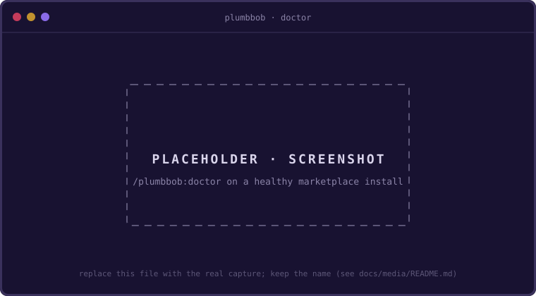

# Install

PlumbBob installs **once, globally**, like `gh` or your dotfiles. Two co-equal,
mutually exclusive ways install it (both register a Claude Code plugin named
`plumbbob`; running both collides over the `/plumbbob:*` namespace). The
[README](../README.md#install) shows the quick form of each; this page is the full
reference.

## Prerequisites

**Node.js ≥ 22.18 on your PATH** is the one external requirement, on either install
path: the `plumbbob`/`pb` shims run the bundled CLI as `node dist/cli.js`, so a
missing or too-old Node is the only thing that stops the binary from running; nothing
here installs Node for you. Everything the CLI itself needs is bundled, including the
`checkride` check gate, so there is no separate build, config, or API key to set up.

## Before your first session

Install scope is global, but a session lives in one repo, and four things have to hold
there before `/plumbbob:plan` can open one:

- **A git repository with at least one commit.** `start` records `HEAD` as the baseline
  every checkpoint and revert measures from.
- **A clean working tree.** Commit or stash first, or pass `--allow-dirty` and accept
  that a revert to baseline discards the uncommitted work.
- **Something for the gate to check.** checkride runs whatever tools the repo configures
  (a `tsconfig.json`, a `vitest.config.ts`, a linter config); with none, it refuses to
  call an empty run green, and `start` says so up front. A repo that gates some other
  way sets `"check"` in `.plumbbob/settings.json`, for example `"check": "npm test"`.
- **A model you would plan with.** Planning is where a frontier model earns its cost;
  the plan can then recommend a smaller one per step, and `/plumbbob:status` shows the
  recommendation before each build.

The words the loop uses (steps, seams, the pause, the latch) are one line each in
[`glossary.md`](glossary.md).

## The marketplace plugin

The marketplace entry resolves to the published `plumbbob` npm package, so Claude
Code installs it for you (the skills, the hooks, and the `plumbbob`/`pb` CLI; its
`bin/` shims land on PATH inside the session) with no `npm i -g` and no `plumbbob
init` of your own. PlumbBob is published in the
[`agent-tools`](https://github.com/robmclarty/agent-tools) marketplace; add it once,
then install the plugin:

```text
/plugin marketplace add robmclarty/agent-tools
/plugin install plumbbob@robmclarty
```

(The `@robmclarty` suffix is the marketplace's name, not the repo's: `agent-tools`
is the repo you add, `robmclarty` is the marketplace it declares.)

Reload (`/reload-plugins`) or restart Claude Code to activate; that is the whole
setup, with nothing left to wire. The CLI is then on PATH *inside the Claude Code
session* (for a plain terminal `plumbbob`, use the npm route below), and all three
hooks (the post-edit lint, the `git commit` ask-hook, and the `UserPromptSubmit`
turn-ledger hook that powers the approval latch) auto-register from `hooks.json`, so
the latch is live out of the box, no manual step. Confirm it in the session with
**`/plumbbob:doctor`**.

## npm global + `init`

The npm package ships the CLI, the skills, and the hook; `plumbbob init` links them
into Claude Code as an in-place plugin:

```sh
npm i -g plumbbob      # the CLI (also a `pb` shorthand)
plumbbob init          # link it into Claude Code; --uninstall to undo
```

`init` symlinks the package into `~/.claude/skills/plumbbob`, where Claude Code loads
it as a plugin; the hooks auto-register from `hooks.json` (the post-edit lint, the
`git commit` ask-hook, and the `UserPromptSubmit` turn-ledger hook behind the approval
latch). Because it's a symlink, a later `npm i -g plumbbob@latest` stays live with no
re-link. If a
marketplace plumbbob is already installed, `plumbbob init` refuses rather than create
the collision (`--force` overrides), and `plumbbob doctor` flags a double-install.

## Namespacing

Either way, Claude Code namespaces the skills under the `plumbbob` plugin, so the
commands are `/plumbbob:plan`, `/plumbbob:status`, and the rest. **The bare form
(`/plan`) reaches the skill only where nothing else owns that name (`plan`, `status`,
`verify`, and `doctor` are Claude Code built-ins, which win), so these docs write the
full form.**
Nothing else under `~` is touched and `settings.json` is left alone; restart Claude
Code (or `/reload-plugins`) to activate.

## Sessions are per-project

Install scope is not session scope: you install the tool once, but each goal lives in
its own repo: `plumbbob start "<goal>"` writes a `.plumbbob/` sidecar there,
independent of the one global link.

## Other agents (roadmap)

The npm package is the agent-neutral carrier; a future `plumbbob init --host
codex|cursor|zed` will place the same skills where those tools look. Claude Code is
the first, first-class target.

## Verify

```sh
plumbbob doctor
```



`doctor` works for either install path: it confirms a marketplace plugin, or checks
that the skills-dir link resolves to the plugin manifest, the skills, and the hooks
(flagging a double-install collision), and prints the exact fix for anything broken.
The terminal command above is for the **global / skills-dir** install; a
**marketplace** plugin puts the CLI on PATH only *inside a Claude Code session*, so
run **`/plumbbob:doctor`** there instead. Run it first if a `/plumbbob:*` skill ever opens
with an empty dashboard; [`troubleshooting.md`](troubleshooting.md) covers the rest.
